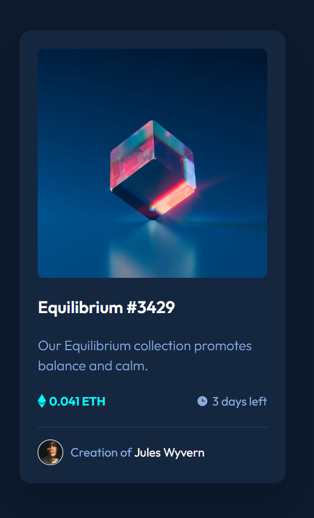

# Frontend Mentor - NFT preview card component solution

This is a solution to the [NFT preview card component challenge on Frontend Mentor](https://www.frontendmentor.io/challenges/nft-preview-card-component-SbdUL_w0U).

# you can view the live site [here.](https://kieranwebdev.github.io/FEMentor-NFTcomponent/)

## Table of contents

- [Overview](#overview)
  - [The challenge](#the-challenge)
  - [Screenshot](#screenshot)
  - [Links](#links)
- [My process](#my-process)
  - [Built with](#built-with)
  - [What I learned](#what-i-learned)
  - [Continued development](#continued-development)
  - [Useful resources](#useful-resources)
- [Author](#author)
- [Acknowledgments](#acknowledgments)

## Overview

### The challenge

Users should be able to:

- View the optimal layout depending on their device's screen size
- See hover states for interactive elements

### Screenshot



### Links

- [Live Site](https://kieranwebdev.github.io/FEMentor-NFTcomponent/)

## My process

### Built with

- Semantic HTML5 markup
- CSS custom properties
- Flexbox
- Mobile first design

### What I learned

- A quick project where I had fun getting more reps in building from a design spec.

- I had a but of trouble getting the hover effects to match the design brief. After some googling I discovered that it's possible to add selectors after the `:hover` pseudo selector in order to be more specific with the properties I wished to change

```
.pic-wrapper:hover .eye-icon {
  z-index: 5;
}
```

## Author

- [Kieran Gill - Portfolio ](https://kieran-gill-portfolio.netlify.app/)
- [Frontend Mentor profile](hhttps://www.frontendmentor.io/profile/KieranWebDev)
- [LinkedIn](www.linkedin.com/in/kieran-gill)
